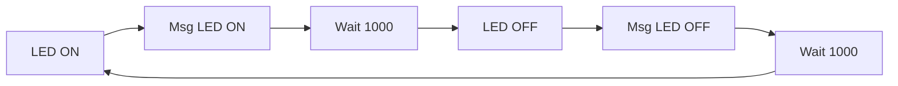
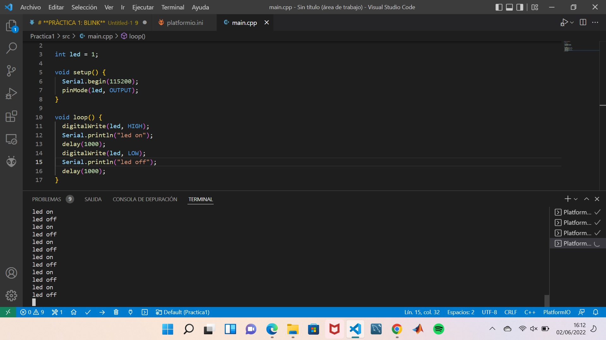

# **PRÀCTICA 1: BLINK**
## **1.1 Codi**
``` c++
int led = 1;

// the setup routine runs once when you press reset:
void setup() {                
  pinMode(led, OUTPUT);     
}

// the loop routine runs over and over again forever:
void loop() {
  digitalWrite(led, HIGH); 
  Serial.print("led on"); 
  delay(1000);               
  digitalWrite(led, LOW);
  Serial.print("led off");     
  delay(1000);               
}
```
## **1.2 Funcionament**

Primerament, es declara el número de pin on es troba el LED, que en aquest cas és el pin numero 1. Seguidament en el setup s'inicialitza el pin digital com una sortida amb la comanda pinMode(led, OUTPUT).
Dins el bucle, loop, amb la comanda digitalWrite(led, HIGH) fem que el LED s'encengui fent que el nivell de voltatge estigui en HIGH. És llavors que amb el delay(1000) s'espera 1 segon i apaga el LED posant el voltatge a LOW amb la comanda digitalWrite(led, LOW).
Finalment amb el delay(2000) s'esperarà 2 segons i tornarà al principi, és a dir, es tornarà a encendre el LED. Mestre tant per la terminal apareixerà el missatge "Led on" i "Led off" en funció de si el led està encès o pagat.

## **1.3 Diagrama de flux**




